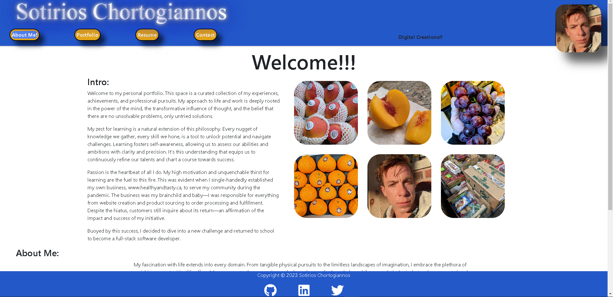

# React Portfolio Webpage

## Description

### Motivation

To create a website to showcase my abilities.

### Build

I learned how to construct a responsive website.

### Solve

It solves the problem of advertising my skills to potential employers.

### Learn

I learned how to perfect the skills i have acquired to produce a responsive website using REACT.

## Table of Contents:

[1. Installation](#Installation)

[2. Usage](#Usage)

[3. License](#License)

[4. Contribution](#Contribution)

[5. Tests](#Tests)

[6. Questions](#Questions)
        
## Installation:

N/A

## Usage:

It is used by visiting the website.

## License:

## Contribution:

Anyone can Contribute

## Tests:

none

## Questions:

The source code of this project can be found on my Github repository at www.github.com/sotiriosc. Feel free to contact 
me any time regarding questions or recomendations. My email is chortogiannoss@gmail.com. Thank you for taking the time to review and use my app. The deployed website can be visited at https://sotiriosc.github.io/portfolioPortalReact/.

        
